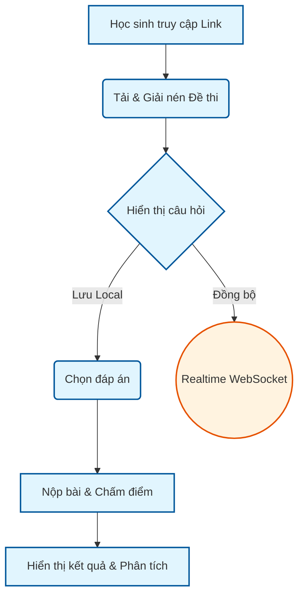
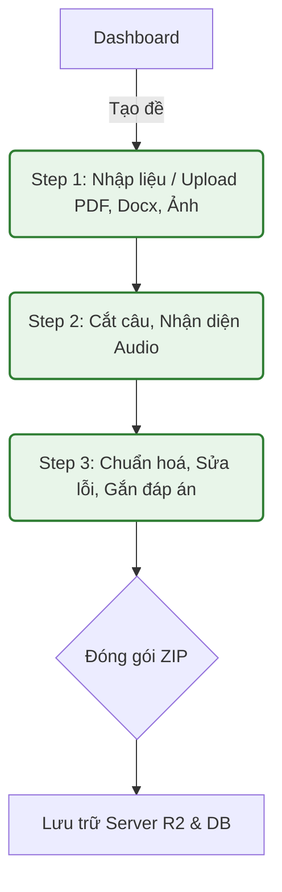

# Zestest System Map & Phân rã cấu trúc

Tài liệu này hệ thống hóa toàn bộ kiến trúc Zestest, kết hợp sơ đồ luồng dữ liệu (Flowchart) và bảng ma trận tính năng (Matrix Table) để giúp nhà phát triển dễ dàng tra cứu chính xác đến từng thư mục, file và cụm hàm khi cần chỉnh sửa hoặc bảo trì.

---

## 1. Sơ đồ Luồng Nghiệp Vụ (Flowcharts)

### 1.1 Luồng Học sinh làm bài thi (Student Flow)

### 1.2 Luồng Giáo viên tạo đề thi (Teacher/Admin Flow)

---

## 2. Bảng Ma Trận Phân Rã Tính Năng (Matrix Table)

Dưới đây là ánh xạ chi tiết: **Cụm Hành động ➔ Hành động ➔ Cụm File/Module ➔ Hàm Thực Thi**.

### 2.1 Cụm Auth & Quản lý Danh tính (Người tạo đề)
| Hành động | Chi tiết hành động | Cụm file/module | Hàm thực thi / Tuyến đường (Route) |
| :--- | :--- | :--- | :--- |
| **Khởi tạo Web** | Màn hình Splash, check thiết bị | `js/splash/app.js` | `App.init()` |
| **Đăng nhập / Danh tính** | Khởi tạo, cấp phát User ID ẩn danh hoặc đăng nhập | `js/auth/identity_manager.js`, `js/auth/auth.js` | `IdentityManager.init()`, `Auth.login()` |
| **Lưu trữ phiên** | Quản lý LocalStorage/SessionStorage | `js/storage/storage_manager.js` | `StorageManager.save()`, `.load()` |
| **API Backend** | Xử lý thông tin user trên Server, cấp Tier (Guest/Pro) | `server/src/routes/identity.ts` | `identityRoutes.get('/me')`, `getUserTier()` |

### 2.2 Cụm Quản lý Dashboard
| Hành động | Chi tiết hành động | Cụm file/module | Hàm thực thi / Tuyến đường (Route) |
| :--- | :--- | :--- | :--- |
| **Hiển thị Dashboard** | Load danh sách đề thi của user | `js/dashboard/dashboard_ui.js`, `dashboard_render.js` | `DashboardUI.init()`, `renderExamCards()` |
| **Thao tác đề thi** | Bật/tắt trạng thái, Xóa đề, Thiết lập số lượt thi | `js/dashboard/dashboard_manager.js` | `DashboardManager.toggleStatus()`, `.deleteExam()` |
| **Tạo đề mới** | Bắt đầu luồng Wizard tạo đề | `js/dashboard/exam_wizard_logic.js` | `ExamWizard.start()` |
| **Chia sẻ đề** | Copy link, chia sẻ cho học sinh | `js/dashboard/referral_manager.js` | `ReferralManager.generateLink()` |

### 2.3 Cụm Quy trình Tạo đề (Step 1 -> 3)
| Cụm Hành động | Hành động chi tiết | Cụm file/module | Hàm thực thi |
| :--- | :--- | :--- | :--- |
| **Step 1 (Nhập liệu)** | Kéo thả/chọn file, quét PDF, Docx, Hình ảnh | `js/step1/step1_handler.js`, `js/step1/input_handler/` | `Step1Handler.processInput()`, `pdf_processor.js`, `docx_processor.js` |
| **Step 2 (Bóc tách)** | Cắt câu tự động, hiển thị card câu hỏi (Preview) | `js/step2/step2_card_logic.js`, `preview_render.js` | `CardLogic.splitQuestions()`, `PreviewRender.render()` |
| | Cắt Audio (Listening) | Tách file âm thanh | `js/step2/audio_processor.js` | `AudioProcessor.slice()` |
| **Step 3 (Hoàn thiện)** | Khai báo đáp án, chuẩn hoá định dạng (ABCD, T/F) | `js/step3/step3_controller.js`, `TypeChecker.js` | `Step3Controller.setupAnswers()`, `TypeChecker.detect()` |
| | Làm sạch text (Normalizer)| Lọc bỏ ký tự thừa, fix lỗi format | `js/step3/UniversalNormalizer.js` | `UniversalNormalizer.clean()` |
| | AI Cải thiện | Sửa lỗi chính tả/format nâng cao | `js/step3/improve.js` | `ImproveHandler.autoFix()` |
| **Đóng gói Đề thi** | Gom file text, audio, config thành file ZIP | `js/dashboard/package_engine.js` | `PackageEngine.zip()` |
| **Upload lên Server** | Đẩy file ZIP qua API | `js/dashboard/upload_handler.js` | `UploadHandler.execute()` |

### 2.4 Cụm Học sinh làm bài (Student Flow)
| Cụm Hành động | Hành động chi tiết | Cụm file/module | Hàm thực thi / API |
| :--- | :--- | :--- | :--- |
| **Chuẩn bị thi** | Mở trang `student/index.html`, giải nén ZIP đề thi | `student/InitData.js`, `ZestUnpackager.js` | `InitData.fetch()`, `ZestUnpackager.extract()` |
| **Bảo mật thi** | Chống chuyển tab (Cheat detection) | `student/security_student.js` | `SecurityMonitor.initBlurDetection()` |
| **Giao diện bài thi** | Khởi tạo Layout PC/Mobile | `student/quiz_controller.js` | `QuizController.init()`, `_setupLayout()` |
| **Làm bài** | Chọn đáp án, đồng bộ màu sắc | `student/quiz_controller.js` | `QuizController.save(qNum, val)` |
| | Mở file Nghe (Audio) | `student/quiz_controller.js` | `AudioController.toggle()`, `_loadAudio()` |
| **Quản lý tổng quan** | Hiện danh sách lưới câu hỏi (Grid), gắn cờ đỏ | `student/stu_manager.js`, `render_manager.js` | `StuManager.toggleFlag()`, `RenderManager.update()` |
| **Xem chi tiết** | Click vào grid để xem chi tiết câu hỏi (văn bản) | `student/detail_manager.js` | `DetailManager.open(qNum)` |
| **Nộp bài** | Chấm điểm, tổng kết (Summary) | `student/submit_handler.js`, `summary_manager.js` | `SubmitHandler.finish()`, `SummaryManager.show()` |
| **Realtime** | Báo cáo tiến độ về phòng thi (DO WebSocket) | `server/src/do/ExamRoom.ts` | `class ExamRoom { fetch(request) }` |

### 2.5 Cụm Server / Backend API (Cloudflare Workers)
| Hành động | Chi tiết | Cụm file/module | Hàm thực thi / Route |
| :--- | :--- | :--- | :--- |
| **Bảo mật (Middleware)**| Chặn ID rác, kiểm tra quyền | `server/src/middlewares/guard.ts` | `checkUserIdValid()` |
| **Quản lý Đề (API)** | Lưu đề thi, cấu hình, giới hạn lượt tạo (Quota) | `server/src/routes/exams.ts` | `examsRoutes.post('/upload-package')`, `.delete('/')` |
| **Dọn dẹp rác** | Xóa file quá hạn trên R2/D1 (Lazy cleanup) | `server/src/services/cleanup.ts` | `cleanupExpiredExams()` |
| **Giao tiếp Client** | Fetch requests, Websocket Sender/Receiver | `js/server/server_comm.js`, `receiver.js`, `sender.js` | `ServerComm.post()`, `Sender.wsSend()` |

---

## 3. Cách sử dụng bảng này để sửa Code
Ví dụ, bạn nhận được yêu cầu: **"Sửa lại giao diện lưới đáp án trên PC khi học sinh làm bài"**
1. Nhìn vào sơ đồ **1.1 Luồng Học sinh làm bài**.
2. Tìm trong bảng **2.4 Cụm Học sinh làm bài**.
3. Bạn sẽ thấy ngay file cần sửa là: `student/quiz_controller.js` (Hàm `_setupLayout()`) hoặc `student/render_manager.js` (để update UI).
4. Bạn có thể mở trực tiếp file đó ra và chỉnh sửa mà không cần phải grep toàn bộ source code.

*Tài liệu này được đồng bộ và cập nhật liên tục với mã nguồn dự án.*
